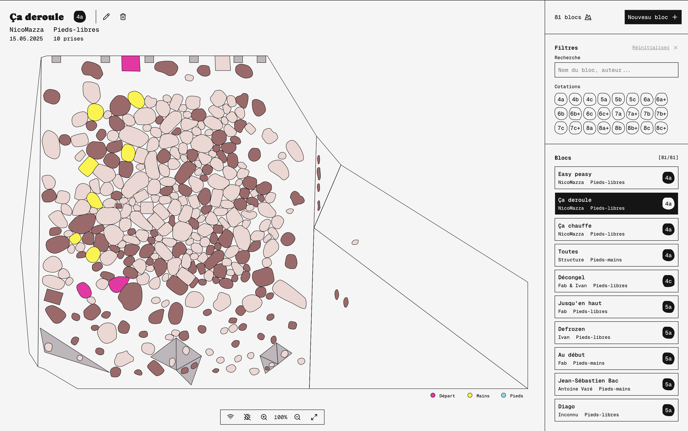

# Le Pierrier

Topographie interactive.



## Requirements

- `node.js` >= 22
- `yarn`

## Installation

`node.js` and `yarn` can be installed via Homebrew:

```bash
brew install node
brew install yarn
```

## Setup

Copy the `exemple.env` file to a new `.env` file.

```bash
yarn init:env
```

Copy the `exemple.db` folder to a new `db` folder.

```bash
yarn init:db
```

## Development

```bash
yarn dev:all
```

It starts a server on `http://localhost:3000`

## Production

To test the production build locally:

```bash
yarn build:all && yarn prod:start
```

It starts a server on `http://localhost:4000`

## Deployement

1. Run the `Deploy on production` GitHub action
2. On Infomaniak server, build the application
3. On Infomaniak server, restart the production server

## Usage

The `/` page is the wall-control interface.
The `/wall` page is the wall display interface.
The `/editor` page is the wall editor interface.

### Shortcuts

- Use the arrow keys to translate the view.
- Use the `+` and `-` keys to zoom in and out.
- Use the `r` and `l` keys to rotate the view.
- Use the `0` key to reset the view.
- Use the `a` key to toggle display of all holds.
