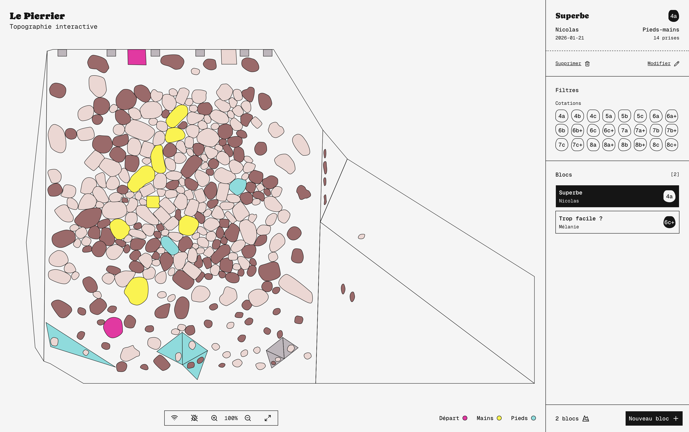

# Le Pierrier

Topographie interactive.



## Requirements

- Node.js >= 22
- yarn

### Installation

Node.js and yarn can be installed via Homebrew:

```bash
brew install node
brew install yarn
```

## Development

Use : `http://localhost:3001`

```bash
yarn dev:all
```

### Setup the environment variables

Copy the `exemple.env` file to a new `.env` file and change the `SOCKET_KEY` value to a secret key of your choice.
During development, add a `NEXT_PUBLIC_SOCKET_KEY` entry that contains the same value as `SOCKET_KEY` to bypass security.

```bash
cp exemple.env .env
```

## Production

Use : `http://localhost:3000`

```bash
yarn build:all
```

### Deploy on the server

Copy files on the server and run:

```bash
yarn prod:all
```

## Usage

The `/` page is the wall-control interface.
The `/wall` page is the wall display interface.

### Transforming the wall view

- Use the arrow keys to translate the view.
- Use the `+` and `-` keys to zoom in and out.
- Use the `r` and `l` keys to rotate the view.
- Use the `0` key to reset the view.
